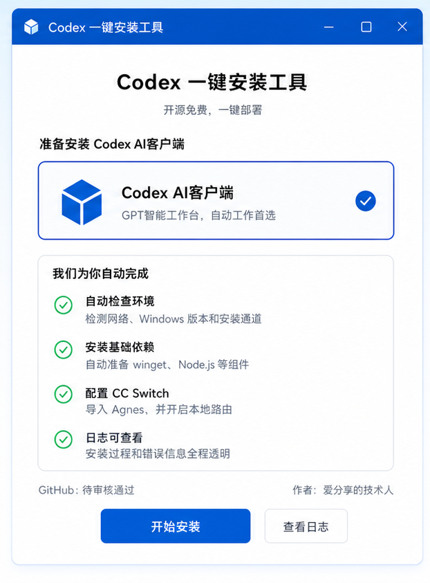
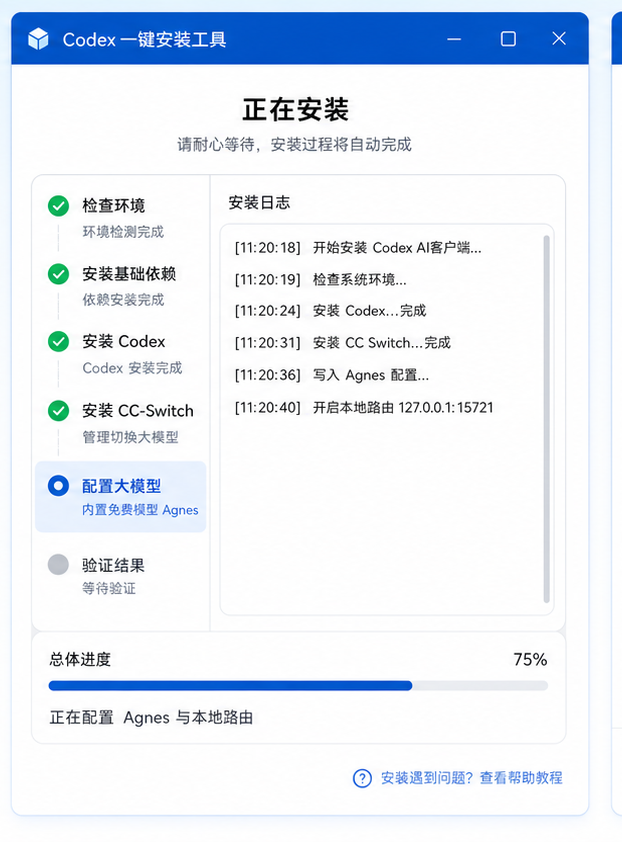
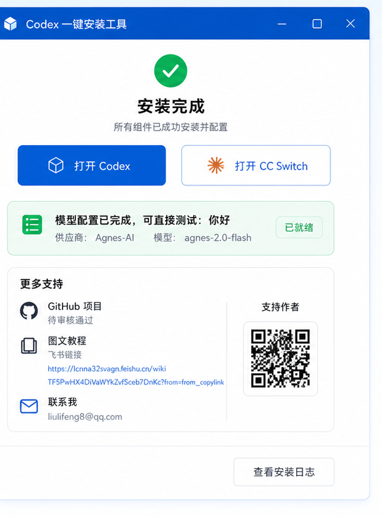
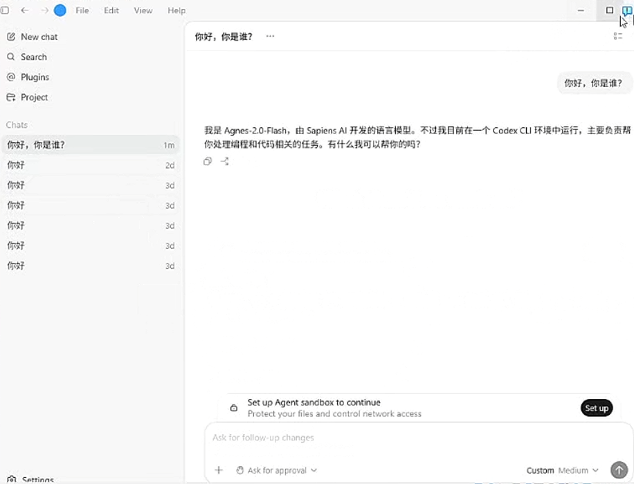

# Codex 一键安装工具

一个面向 Windows 10/11 x64 用户的 Codex AI 客户端一键安装器。

我做这个工具的目的很简单：让普通用户先把 Codex、CC Switch、本地路由和 Agnes 体验模型跑起来，不要在环境变量、模型配置、依赖安装这些第一步里被劝退。

> 这是个人开源项目，不是 OpenAI、Anthropic、CC Switch 或 Agnes 的官方产品。

## 当前能力

- 一键安装 Codex AI 客户端。
- 自动检查 Windows 环境和网络状态。
- 自动准备基础依赖，包括 Node.js、winget / App Installer。
- 自动安装或检测 CC Switch。
- 自动写入 Agnes-AI 模型配置。
- 默认配置 Codex 走 CC Switch 本地路由。
- 安装日志全程可查看，方便排查问题。
- 打包为 Windows portable 单文件 exe，双击直接进入主界面。

## 适用系统

- Windows 10 x64
- Windows 11 x64

## 下载使用

正式发布包请在 GitHub Releases 下载。

使用步骤：

1. 下载最新的 `AI-Coder-Installer-*.exe`。
2. 双击打开。
3. 点击 `开始安装`，安装器会先做环境检测与依赖准备。
4. 安装完成后点击 `打开 Codex`。
5. 在 Codex 里输入 `你好` 测试模型是否可用。

### 安装流程预览

#### 步骤一：准备安装
打开安装器后，工具会自动检查 Windows 环境和网络状态，点击开始安装即可。



#### 步骤二：正在安装
工具会按顺序安装 Codex AI 客户端、CC Switch 路由工具，并写入 Agnes-AI 模型配置。



#### 步骤三：安装完成
全部组件安装就绪，点击「打开 Codex」即可使用。第一次启动后在 Codex 里输入 `你好` 测试模型。如果需要更换大模型，可以打开CC Switch进行更换。



#### 步骤四：和 Codex 第一次对话
打开 Codex 后，在输入框里发送 `你好`，看到模型回复「你好，你是谁」之类的内容，就说明 Codex 已经接上 Agnes-2.0-Flash 模型了。



好的，看到 Codex 回复你的信息就全部完成了！恭喜你已经打开了 AI 新世界的大门！

## 项目主页与教程

- 飞书图文教程：[老刘做工作流：一年帮 100 个人做成 AI 工作流](https://lcnna32svagn.feishu.cn/wiki/TF5PwHX4DiVaWYkZvfSceb7DnKc?from=from_copylink)
- 仓库内备份：[Markdown 文档](docs/老刘做工作流：一年帮%20100%20个人做成%20AI%20工作流.md)
- 仓库内备份：[PDF 文档](docs/laoliu-ai-workflow.pdf)

这也是我正在做的长期计划：一年帮 100 个人把真实工作做成 AI 工作流。

## 作者

作者实名刘力峰。

我更关心 AI 是否能解决真实工作问题，而不是追热点讲概念。如果你每天有重复、琐碎、耗时间的工作，欢迎把场景发给我。

联系方式：

- 邮箱：liulifeng8@qq.com
- 抖音：老刘做工作流

## 开发运行

安装依赖：

```bash
npm install
```

开发运行：

```bash
npm start
```

语法检查：

```bash
npm run check
```

打包：

```bash
npm run build
```

构建产物会输出到 `dist/`，文件名带构建时间戳，例如：

```text
AI-Coder-Installer-0.1.0-build.20260613.201636-x64.exe
```

## 仓库文件说明

源码仓库不会提交以下内容：

- `node_modules/`
- `dist/`
- `.tmp-winget/`
- 体积较大的 winget / App Installer 离线资源

CC Switch MSI 体积较小，会随源码保留，方便打包时内置。

winget / App Installer 大资源如果没有被内置，安装器会在运行时联网下载。

## 安全提醒

- 只建议从本项目 Release 或作者明确提供的链接下载。
- 不要从陌生群文件或二次转发链接下载。
- 长期使用建议换成你自己的 API Key 或服务配置。
- 不要把账号密码、支付密码、企业内部资料发给任何安装工具或陌生人。

## License

本项目采用不可商用授权，详见 [LICENSE](LICENSE)。
